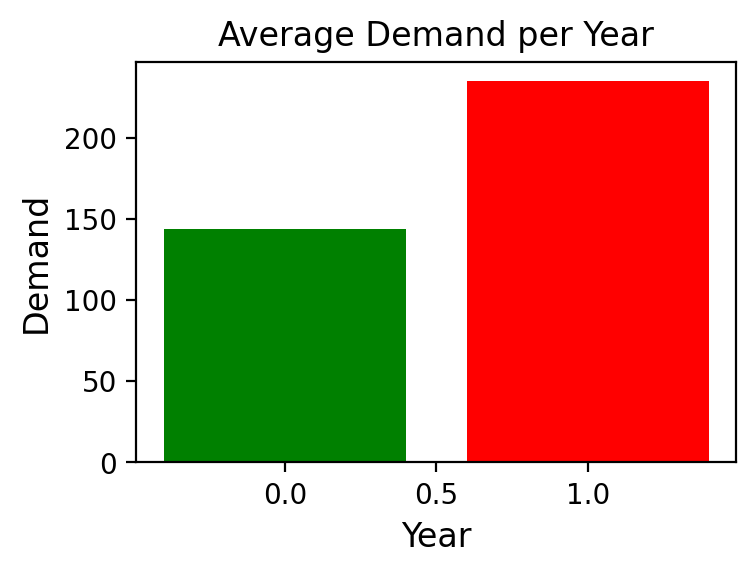

 
## Bike Sharing Enterprise 

### Inception
This is a project of analysis of available data from the <b>Bike Sharing company</b>. 
Bike sharing is based in the public bicycle scheme. It is a service to share use to individuals on a short term basis for a price or free. The scheme of sharing bikes allows people to borrow a bike from a "dock" and return it at another dock belonging to the same system.

Companies page: https://www.capitalbikeshare.com/

UCI dataset Repository: https://archive.ics.uci.edu/ml/datasets/bike+sharing+dataset

### Problem description

Docks are the special bike racks that lock the bike, and only release it by computer control. The logistics process focuses on the activities of providing "docks" in appropriate zones, allowing convenient access to equipment for any potential user. 
In the analyse we were analyzed external areas, get to know what affects the size of the demand.

### Data set

The data was collected in order to analyze the external phenomena of the company from the UCI data collection repository.

Author of data set: Hadi Fanaee-T - Laboratory of Artificial Intelligence and Decision Support (LIAAD), University of Porto

Author of data analysis: mikey.prus@gmail.com

### Data description 
This dataset contains the <b>hourly and daily</b> count of rental bikes <b>between years 2011 and 2012</b> in Capital bikeshare system with the corresponding <b>weather and seasonal information</b>.

### Data Records

- instant: record index
- dteday : date
- season : season (1:winter, 2:spring, 3:summer, 4:fall)
- yr : year (0: 2011, 1:2012)
- mnth : month ( 1 to 12)
- hr : hour (0 to 23)
- holiday : weather day is holiday or not (extracted from [Web Link])
- weekday : day of the week
- workingday : if day is neither weekend nor holiday is 1, otherwise is 0.

+ weathersit :
- 1: Clear, Few clouds, Partly cloudy, Partly cloudy
- 2: Mist + Cloudy, Mist + Broken clouds, Mist + Few clouds, Mist
- 3: Light Snow, Light Rain + Thunderstorm + Scattered clouds, Light Rain + Scattered clouds
- 4: Heavy Rain + Ice Pallets + Thunderstorm + Mist, Snow + Fog
- temp : Normalized temperature in Celsius. The values are derived via (t-t_min)/(t_max-t_min), t_min=-8, t_max=+39 (only in hourly scale)
- atemp: Normalized feeling temperature in Celsius. The values are derived via (t-t_min)/(t_max-t_min), t_min=-16, t_max=+50 (only in hourly scale)
- hum: Normalized humidity. The values are divided to 100 (max)
- windspeed: Normalized wind speed. The values are divided to 67 (max)
- casual: count of casual users
- registered: count of registered users
- cnt: count of total rental bikes including both casual and registered

### Technologies
* pandas
* matplotlib.pyplot

### Goal

* The effect of external factors on the size of demand.

* Provide convenient access to equipment for any potential user. 

### Graphical representation in terms of time period 2011 - 2012

The chart above represents growing trend in the customers demand of bike sharing system. It could be caused of good quality of the companies equipment and proper product promotion.

The graph in terms of the month shows the highest records of product demand represent potential customer needs. The graph shows the high record in a relatively warm period. The highest demand was in the summer period, even 200% compared to the lowest score in January. Low records are caused by winter and spring and the danger of driving a bike.

The winter period is a great period for company to build the tests, try new technologies to upgrade the offer and service, or replace current equipment.

The low intensive period happens between November - March. An average of 130 customers per month uses our product.

This case represents the huge effect of the weather on customers demand.

The chart above confirms demand dependence on season weather.